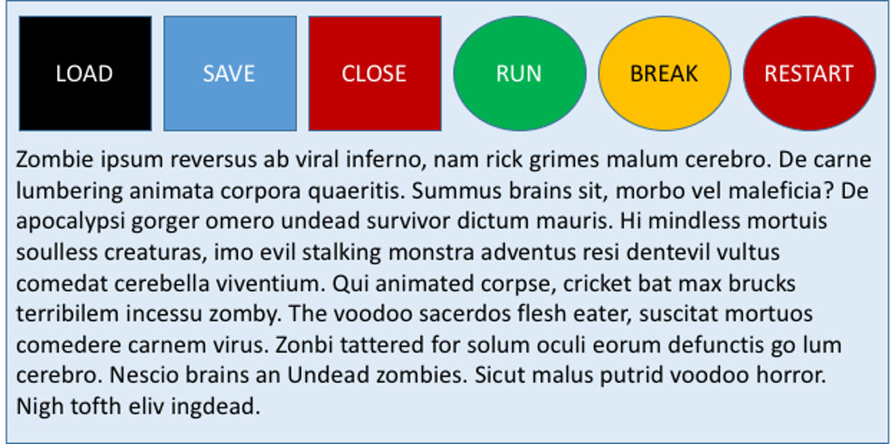

# Part A: Perception and cognition

{#id .class width=60% height=60% align=center}

**Color perception**: red and green are used together, and this is not recommended due to possible confusion problems for people with visual impairments like colorblindness. Therefore, different colors should be used for Close, Run and/or Restart buttons.

**Gesalt laws, simmetry and connection**: the buttons are asymmetric: the square and the oval buttons are supposed to belong to different fields of interest, and therefore they should not be on the same line. In order to improve this part of the design, connection could be exploited, for example moving the oval or the square buttons under the others.

**Gesalt laws, proximity**: even if symmetry is not respected (as stated in the previous paragraph), the design somewhat follows the proximity theory: the buttons are in fact near to each other, and separated from the text.

# Part B: Identifying potential usability problems

## 1. Potential usability issues

**Anthropometry**

A possible anthropometry-related issue could be the weight of the display; even a medium light device, in fact, can be heavy on the neck if worn for too much time.
Another issue is the calibration of the device on the exact shape of the body of the surgeon (height, size of head, posture); if it is not calibrated, this could lead to discomfort and then to a worse use experience.
\newpage
**Behavior**

From the behavioral point of view, the things displayed on the device could impede (possibly part of) the sight of the surgeon. The device could also suffer from parallax problems, hence it should be calibrated on the exact shape of body of the user (as stated in the previous paragraph).

**Cognition**

In addition to the possibility of impeding the sight, from the cognition perspective the things displayed could also distract the surgeon's attention, possibly leading them to neglect the sorrouding envirnonment that is also important during a surgery.
A different cognition-related issue could also be the risk for the user to forget how a surgery is done properly without the automation brought by the device (if not totally, at least in part).

**Social aspect**

A possible social aspect issue could be the misalignment between what the surgeon (the user of the display) and other components of the crew are seeing; if not addressed properly, this problem could lead to having different people seeing different things, and this could not be desirable during a surgery.

## 2. How can HCI help solve such problems?

Human Computer Interaction can help with most of the issues listed above. First of all, the device should be designed to be not heavy and to fit perfectly to the body shape of the surgeon making it customizable. If this is not possible, it should at least be possible to remove it and put it back on without consequences.
Speaking of interface, what the surgeon sees thanks to the device should not impede the sight of the rest of the environment. Hence, the designer should carefully decide where to put information (e.g. on the side of the field of view) and how to make possible to see through (e.g. using transparencies).
Finally, the device should provide some method to the other members of the crew to see exactly the same things the surgeon is seeing, in order to "cognitively align" everyone.